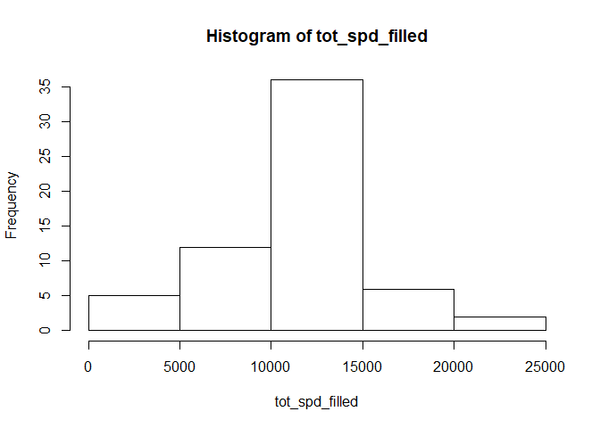

## Loading and preprocessing the data

```r
spd_data<-read.csv("activity/activity.csv")
spd_data$date <- as.Date(spd_data$date)
```

## What is mean total number of steps taken per day?

```r
tot_spd <- by(data = spd_data$steps,spd_data$date, sum,na.rm=T)
hist(tot_spd)
```

<!-- -->

```r
mean(tot_spd)
```

```
## [1] 9354.23
```

```r
median(tot_spd)
```

```
## [1] 10395
```

## What is the average daily activity pattern?

```r
spd_by_min <- by(data= spd_data$steps,spd_data$interval, mean, na.rm=T )
plot(spd_by_min,type="l")
```

<!-- -->

```r
which(spd_by_min==max(spd_by_min))
```

```
## 835 
## 104
```

## Imputing missing values

```r
sum(is.na(spd_data$steps))
```

```
## [1] 2304
```

```r
spd_data_filled <- spd_data
avgs_vec <- rep(spd_by_min,length(spd_data$steps)/length(spd_by_min))
spd_data_filled$steps[is.na(spd_data_filled$steps)] = avgs_vec[is.na(spd_data_filled$steps)]

tot_spd_filled <- by(data = spd_data_filled$steps,spd_data_filled$date, sum,na.rm=T)
hist(tot_spd_filled)
```

<!-- -->

```r
mean(tot_spd_filled)
```

```
## [1] 10766.19
```

```r
median(tot_spd_filled)
```

```
## [1] 10766.19
```
Note that these values are slightly higher than before (and the distribution is more symmetric)


## Are there differences in activity patterns between weekdays and weekends?

```r
spd_data_filled$is_weekend <- weekdays(spd_data_filled$date)%in%c("Sunday","Saturday")
spd_data_filled_weekday = spd_data_filled[!spd_data_filled$is_weekend,]
spd_data_filled_weekend = spd_data_filled[spd_data_filled$is_weekend,]

spd_by_min_weekday <- by(data= spd_data_filled_weekday$steps,spd_data_filled_weekday$interval, mean, na.rm=T )
spd_by_min_weekend <- by(data= spd_data_filled_weekend$steps,as.numeric(spd_data_filled_weekend$interval), mean, na.rm=T )
par(mfrow = c(2,1))
plot(spd_by_min_weekday,type="l")
plot(spd_by_min_weekend,type="l")
```

<!-- -->
